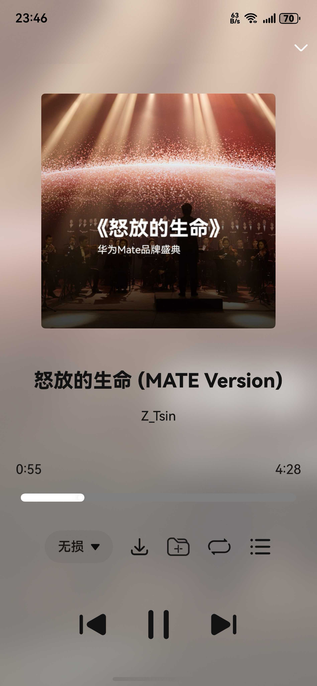

## Cloud Music For HarmonyOS NEXT

**CloudMusic (云音汇) 是鸿蒙NEXT上的网易云音乐第三方App**

该项目基于 OHOS API13，支持 HarmonyOS 5.0 及以上系统版本。

**[!] 由于AppGallery的复审机制可能会导致尝鲜应用下架，建议各位自行编译或使用hap安装。**

### 安装方式

- 自行编译安装
- 通过本仓库release中的hap包安装

### 当前支持功能：

- 云音乐账号登录
- 个人歌单获取
- 音乐云盘
- 每日推荐
- 歌曲、歌单搜索
- 歌单收藏/取消收藏
- 歌单内歌曲添加/删除
- 下载歌曲
- 播放相关功能

### 开发参考：

- [华为开发者官网指南](https://developer.huawei.com/consumer/cn/doc/harmonyos-guides-V5/application-dev-guide-V5?catalogVersion=V5)
- [NeteaseCloudMusicApi](https://gitlab.com/Binaryify/neteasecloudmusicapi)
- [Music Sharing](https://github.com/Okysu/harmony-next-music-sharing)
- [OpenHarmony三方库 @pura/harmony-utils](https://ohpm.openharmony.cn/#/cn/detail/@pura%2Fharmony-utils)
- [OpenHarmony三方库 @yunkss/ef_audio](https://ohpm.openharmony.cn/#/cn/detail/@yunkss%2Fef_audio)
- [OpenHarmony三方库 @pie/lazy-data](https://ohpm.openharmony.cn/#/cn/detail/@pie%2Flazy-data)

### 界面预览：

