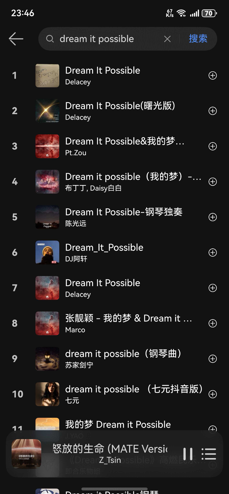
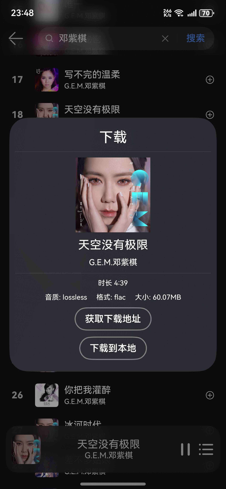
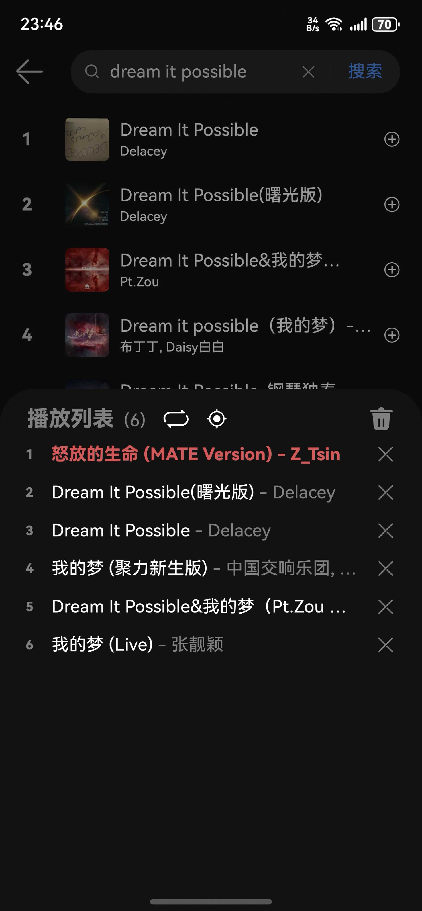

## Cloud Music For HarmonyOS NEXT

**CloudMusic (云音汇) 是鸿蒙5.0上的网易云音乐三方版**

使用本软件，用户可以登录网易云账号，并通过歌单、搜索，播放、下载歌曲

该项目基于API 13，适用于 HarmonyOS NEXT

该项目当前为测试版本，更多功能敬请期待。

AG尝鲜：https://docs.chenlvin.cc/cloudmusic/#/

### 当前支持功能：

- 网易云账号登录
- 个人歌单获取
- 歌曲搜索
- 歌曲播放
- 获取歌曲下载链接
- 歌曲下载到本地
- 保存音频文件至本机

### 开发参考：

- [华为开发者官网指南](https://developer.huawei.com/consumer/cn/doc/harmonyos-guides-V5/application-dev-guide-V5?catalogVersion=V5)
- [NeteaseCloudMusicApi](https://gitlab.com/Binaryify/neteasecloudmusicapi)
- [OH三方库 @pura/harmony-utils](https://ohpm.openharmony.cn/#/cn/detail/@pura%2Fharmony-utils)
- [OH三方库 @yunkss/ef_audio](https://ohpm.openharmony.cn/#/cn/detail/@yunkss%2Fef_audio)
- [Music Sharing](https://github.com/Okysu/harmony-next-music-sharing)

### 界面预览：

