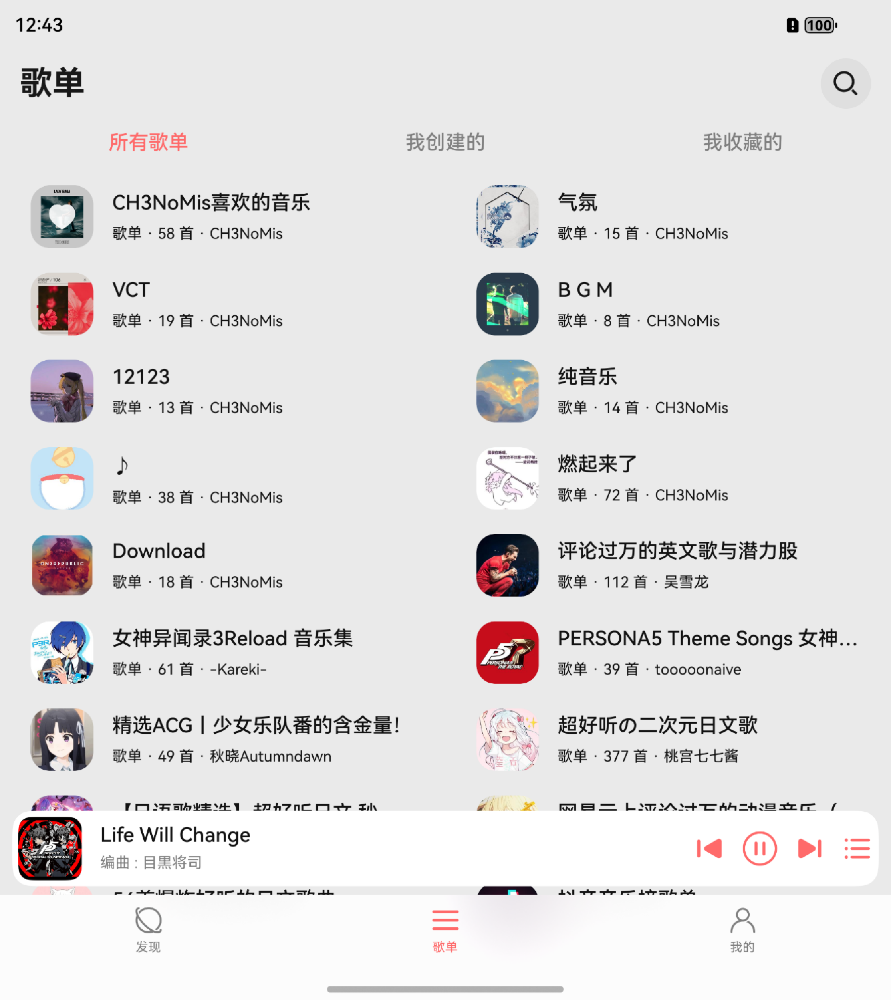

## Cloud Music For HarmonyOS NEXT

🎵 云音汇 | ✨ 鸿蒙原生应用

**本项目为第三方应用, 应用不提供在线服务, 仅提供UI界面**

**[在Release下载hap包](https://github.com/Chenlvin/CloudMusic-HarmonyOSNext/releases)**

### 使用说明

支持**本地播放**与**在线播放**

在线播放需要用户自行设置播放源

使用文档：https://docs.chenlvin.cc/cloudmusic/#/help

### 技术特性
- ArkTS 语言开发
- 基于 OHOS API 15
- 适配 HarmonyOS NEXT **5.0.0.135** 及以上版本

### 安装方式

- 自行编译安装
- 侧载 Release 中的 hap 包

### 实现功能

- 【账号】网页登录、二维码登录、Cookie登录
- 【搜索】搜索歌曲、歌单和歌手
- 【推荐】每日推荐、排行榜、个人推荐歌单
- 【歌单】查看自己的歌单、收藏/取消收藏歌单、增删歌单内歌曲、删除歌单
- 【歌曲】喜欢歌曲、查看歌手
- 【歌手】歌手详情页支持查看歌手简介和热门歌曲
- 【专辑】支持查看、播放专辑
- 【评论】支持查看歌曲热评
- 【播客】支持查看、播放用户收藏的播客
- 【云盘】查看、播放、缓存自己音乐网盘内的歌曲
- 【缓存】缓存歌曲至应用沙箱、导入导出沙箱文件
- 【播放】播放在线歌曲和本地文件、歌词显示、定时关闭、播放列表
- 【系统】全局适配折叠屏与Pad、接入系统播控中心、全局适配深色模式

### 免责声明

本应用为**第三方开源客户端**，**仅提供音乐播放界面**，不分发任何受版权保护的内容。

### 开发参考与三方库

- [NeteaseCloudMusicApi](https://gitlab.com/Binaryify/neteasecloudmusicapi)
- [@pura/harmony-utils](https://ohpm.openharmony.cn/#/cn/detail/@pura%2Fharmony-utils)
- [@pura/picker_utils](https://ohpm.openharmony.cn/#/cn/detail/@pura%2Fpicker_utils)
- [@pie/lazy-data](https://ohpm.openharmony.cn/#/cn/detail/@pie%2Flazy-data)
- [@sj/mediacache](https://ohpm.openharmony.cn/#/cn/detail/@sj%2Fmediacache)

### 界面预览
#### Phone - 手机设备
|**发现页**|**云盘界面**|**播控界面**|
|:----------:|:----------:|:----------:|
||||
|**播放页功能**|**歌词界面**|**播放列表**|
||||

#### Tablet - 平板设备
|**播控/歌词界面**|**平行界面**|
|:----------:|:----------:|
|||

#### Foldable - 折叠设备
|**歌单页**|**播控/歌词界面**|
|:----------:|:----------:|
|||
