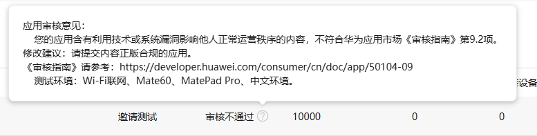
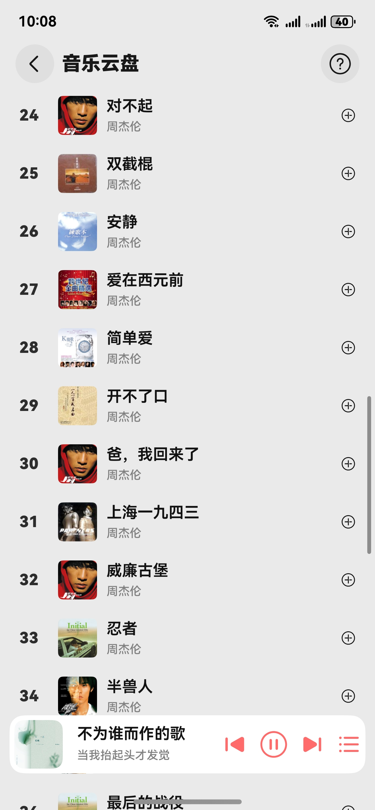

## Cloud Music For HarmonyOS NEXT

🎵 云音汇 | ✨ 鸿蒙原生应用 🎼 第三方云音乐客户端 

本分支根据**[CloudMusic-HarmonyOSNext](https://github.com/Chenlvin/CloudMusic-HarmonyOSNext)**进行改版（原版适合平板和手机，但本版本只适合手机使用），在界面上与原版的主要差别是去除tabs切换组件，并增加悬浮按钮，切换tab的操作依靠悬浮按钮手势操作：
- 按住悬浮按钮`左滑/右滑`：左/右切换tab
- 按住悬浮按钮`上滑/下滑`：切换上一首/下一首
- `单击`悬浮按钮：返回置顶
- `双击`悬浮按钮：播放/暂停

**应用市场审核不通过，请各位自行侧载安装**

**[在Release下载hap包](https://github.com/Chenlvin/CloudMusic-HarmonyOSNext/releases)**

### 技术特性
- ArkTS 语言开发
- 基于 OHOS API 14
- 适配 HarmonyOS NEXT 5.0.0.123 及以上版本

### 安装方式

- 自行编译安装
- 侧载 Release 中的 hap 包

### 使用说明

本项目基于 [NeteaseCloudMusicApi](https://gitlab.com/Binaryify/neteasecloudmusicapi) ，初次使用需要手动填入API服务器地址。

### 实现功能：

- 【账号】网页登录、二维码登录
- 【歌单】查看自己的歌单、收藏/取消收藏歌单、增删歌单内歌曲、删除歌单
- 【云盘】查看、播放、缓存自己音乐网盘内的歌曲
- 【推荐】每日推荐、排行榜、个人推荐歌单
- 【搜索】搜索歌曲和歌单
- 【缓存】缓存歌曲至应用沙箱、导入导出沙箱文件
- 【播放】播放在线歌曲和本地文件、歌词显示、定时关闭、播放列表
- 【设置】自定义API服务器、手动设置Cookie
- 【系统】全局适配Pad端UI、接入系统播控中心、全局适配深色模式

### 开发参考：

- [华为开发者联盟](https://developer.huawei.com/consumer/cn/develop/)
- [NeteaseCloudMusicApi](https://gitlab.com/Binaryify/neteasecloudmusicapi)
- [Music Sharing](https://github.com/Okysu/harmony-next-music-sharing)
- [OpenHarmony三方库 @pura/harmony-utils](https://ohpm.openharmony.cn/#/cn/detail/@pura%2Fharmony-utils)
- [OpenHarmony三方库 @pie/lazy-data](https://ohpm.openharmony.cn/#/cn/detail/@pie%2Flazy-data)

### 免责声明：

本应用为**第三方开源客户端**，**仅提供音乐播放界面**，不分发任何受版权保护的内容。 请注意：

- 📜本应用基于 [NeteaseCloudMusicApi](https://gitlab.com/Binaryify/neteasecloudmusicapi) 开发 **应用本身不提供音乐数据**，部分功能使用网易云音乐第三方API服务，仅供个人学习使用，禁止用于商业用途
- 🔒用户需对自行配置的API合法性负责，**禁止**用于商业或侵权行为
- ⚖️音乐**版权归属**网易云音乐/原始权利人，应用与其**无任何关联**

本项目开发者承诺严格遵守相关法律法规，**不承担**因滥用导致的版权纠纷等风险，请通过**官方渠道**支持创作者。

### 界面预览：

 

<video src="./images/006.mp4" width='20%'></video>

### 开源许可：

Copyright (c) 2024-present Chenlvin

Permission is hereby granted, free of charge, to any person obtaining a copy of this software and associated documentation files (the “Software”), to deal in the Software without restriction, including without limitation the rights to use, copy, modify, merge, publish, distribute, sublicense, and/or sell copies of the Software, and to permit persons to whom the Software is furnished to do so, subject to the following conditions:

The above copyright notice and this permission notice shall be included in all copies or substantial portions of the Software.

THE SOFTWARE IS PROVIDED “AS IS”, WITHOUT WARRANTY OF ANY KIND, EXPRESS OR IMPLIED, INCLUDING BUT NOT LIMITED TO THE WARRANTIES OF MERCHANTABILITY, FITNESS FOR A PARTICULAR PURPOSE AND NONINFRINGEMENT. IN NO EVENT SHALL THE AUTHORS OR COPYRIGHT HOLDERS BE LIABLE FOR ANY CLAIM, DAMAGES OR OTHER LIABILITY, WHETHER IN AN ACTION OF CONTRACT, TORT OR OTHERWISE, ARISING FROM, OUT OF OR IN CONNECTION WITH THE SOFTWARE OR THE USE OR OTHER DEALINGS IN THE SOFTWARE.