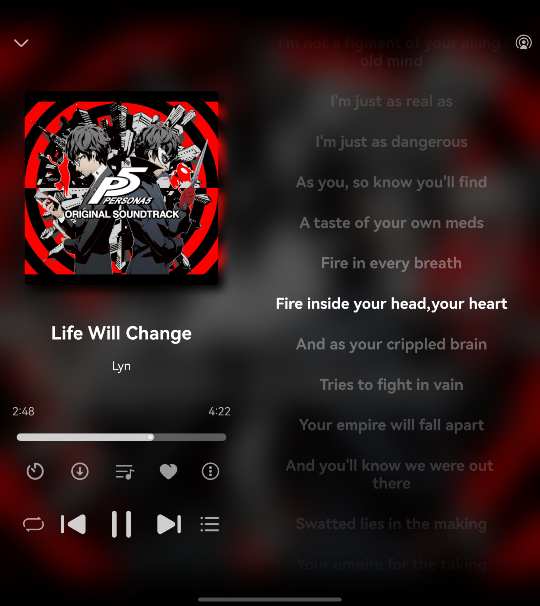

## Cloud Music For HarmonyOS NEXT

🎵 云音汇 | ✨ 鸿蒙原生应用

**本项目为第三方应用, 应用不提供在线服务, 仅提供UI界面**

**[在Release下载hap包](https://github.com/Chenlvin/CloudMusic-HarmonyOSNext/releases)**

### 使用说明

支持**本地播放**与**在线播放**

在线播放需要用户自行设置播放源

使用文档：https://docs.chenlvin.cc/cloudmusic/#/help

### 技术特性
- ArkTS 语言开发
- 基于 OHOS API 15
- 适配 HarmonyOS NEXT **5.0.0.135** 及以上版本

### 安装方式

- 自行编译安装
- 侧载 Release 中的 hap 包

### 实现功能

- 【账号】网页登录、二维码登录、Cookie登录
- 【搜索】搜索歌曲、歌单和歌手
- 【推荐】每日推荐、排行榜、个人推荐歌单
- 【歌单】查看自己的歌单、收藏/取消收藏歌单、增删歌单内歌曲、删除歌单
- 【歌曲】喜欢歌曲、查看歌手
- 【歌手】歌手详情页支持查看歌手简介和热门歌曲
- 【播客】支持查看、播放用户收藏的播客
- 【云盘】查看、播放、缓存自己音乐网盘内的歌曲
- 【缓存】缓存歌曲至应用沙箱、导入导出沙箱文件
- 【播放】播放在线歌曲和本地文件、歌词显示、定时关闭、播放列表
- 【系统】全局适配折叠屏与Pad、接入系统播控中心、全局适配深色模式

### 免责声明

本应用为**第三方开源客户端**，**仅提供音乐播放界面**，不分发任何受版权保护的内容。

### 开发参考与三方库

- [NeteaseCloudMusicApi](https://gitlab.com/Binaryify/neteasecloudmusicapi)
- [@pura/harmony-utils](https://ohpm.openharmony.cn/#/cn/detail/@pura%2Fharmony-utils)
- [@pura/picker_utils](https://ohpm.openharmony.cn/#/cn/detail/@pura%2Fpicker_utils)
- [@pie/lazy-data](https://ohpm.openharmony.cn/#/cn/detail/@pie%2Flazy-data)
- [@sj/mediacache](https://ohpm.openharmony.cn/#/cn/detail/@sj%2Fmediacache)

### 界面预览
#### Phone - 手机设备
|**发现页**|**云盘界面**|**播控界面**|
|:----------:|:----------:|:----------:|
||||
|**播放页功能**|**歌词界面**|**播放列表**|
||||

#### Tablet - 平板设备
|**播控/歌词界面**|**平行界面**|
|:----------:|:----------:|
|||

#### Foldable - 折叠设备
|**歌单页**|**播控/歌词界面**|
|:----------:|:----------:|
|||

### 开源许可
Copyright (c) 2024-present Chenlvin

Permission is hereby granted, free of charge, to any person obtaining a copy of this software and associated documentation files (the “Software”), to deal in the Software without restriction, including without limitation the rights to use, copy, modify, merge, publish, distribute, sublicense, and/or sell copies of the Software, and to permit persons to whom the Software is furnished to do so, subject to the following conditions:

The above copyright notice and this permission notice shall be included in all copies or substantial portions of the Software.

THE SOFTWARE IS PROVIDED “AS IS”, WITHOUT WARRANTY OF ANY KIND, EXPRESS OR IMPLIED, INCLUDING BUT NOT LIMITED TO THE WARRANTIES OF MERCHANTABILITY, FITNESS FOR A PARTICULAR PURPOSE AND NONINFRINGEMENT. IN NO EVENT SHALL THE AUTHORS OR COPYRIGHT HOLDERS BE LIABLE FOR ANY CLAIM, DAMAGES OR OTHER LIABILITY, WHETHER IN AN ACTION OF CONTRACT, TORT OR OTHERWISE, ARISING FROM, OUT OF OR IN CONNECTION WITH THE SOFTWARE OR THE USE OR OTHER DEALINGS IN THE SOFTWARE.
